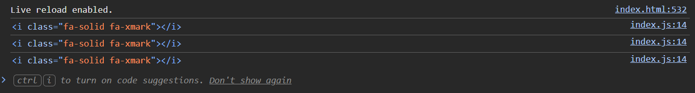

## Code Review Exercise

### Issue #1: Debugging tools left in final code

The issue, why this is an issue, and the solution:

There is still a console.log(...) left in the close popup window handler. This is a problem because this doesnt have any real uses for warnings or errors so it should not be left in the final product. Also you don't want people to know whats happening under the hood of your website. This type of logging should only be done for debugging, and its important to remeber to remove it from any real products. We can fix this by deleting it.



Initial code:

```js
for (const closePopupButton of closePopupButtons) {
  closePopupButton.addEventListener('click', (event) => {
    console.log(event.target);
    const popupSection =
      event.currentTarget.parentElement.parentElement.parentElement;
    popupSection.style.display = 'none';
  });
}
```

Updated code:

```js
for (const closePopupButton of closePopupButtons) {
  closePopupButton.addEventListener('click', (event) => {
    const popupSection =
      event.currentTarget.parentElement.parentElement.parentElement;
    popupSection.style.display = 'none';
  });
}
```

### Issue #2: Form feilds 

The submit button and the reset buttons are outside of the form. Meaning they don't actually do anything related to the form which might be misleading looking at the webpage. The entire form is rendered and closed before the buttons are even created. We can fix this issue by closing the form after the buttons are rendered and created.

Initial code:

```html
<div class="dark-background-container">
    <form id="RequestInfo" class="content-container form">
        <!-- FORM STUFF... -->
    </form>
        <div
            class="form space-evenly-distributed-row-container form-buttons-container"
        >
            <input class="form-button" type="submit" value="submit" />
            <input class="form-button" type="reset" value="reset" />
        </div>
</div>
```

Updated code:

```html
<div class="dark-background-container">
    <form id="RequestInfo" class="content-container form">
        <!-- FORM STUFF... -->
    
        <div class="form space-evenly-distributed-row-container form-buttons-container">
            <input class="form-button" type="submit" value="submit" />
            <input class="form-button" type="reset" value="reset" />
        </div>
    </form>
</div>
```

### Issue #3: Close buttons

Both the Orgin and acceptance buttons dont have arialabel or title attributes. Screen reader will have no idea what these things are for. Lets make them match the popularity button to fix it.


Initial:
```html
<h3>Origin</h3>
  <button class="close-popup-button">
    <i class="fa-solid fa-xmark"></i>
  </button>
```

After:
```html
<h3>Origin</h3>
  <button
  class="close-popup-button"
  aria-label="close popup window"
  title="close popup window"
  >
  <i class="fa-solid fa-xmark"></i>
```

### Issue #4: Tags as buttons 

The more info button and the reload cats are not buttons, they use <a> tags with no href which are not able to be clicked by screen readers. To fix this we should change them to buttons.


Initial:
```html
<a class="more-info-button">More Info</a>
```

After:
```html
<button class="more-info-button">More Info</button>
```


### Issue #5: Pop ups missing role and aria modal

The modals do not have a role attribute or aria modal so screen readers would have no idea this isnt part of the main page. Adding these attributes keeps the focus of the screen readers on the popup.


Initial:
```html
<div class="popup-section-container">
          <div class="popup-section">
```

After:
```html
<div class="popup-section-container">
          <div class="popup-section" role="dialog" aria-modal="true" aria-label="More information">
```


